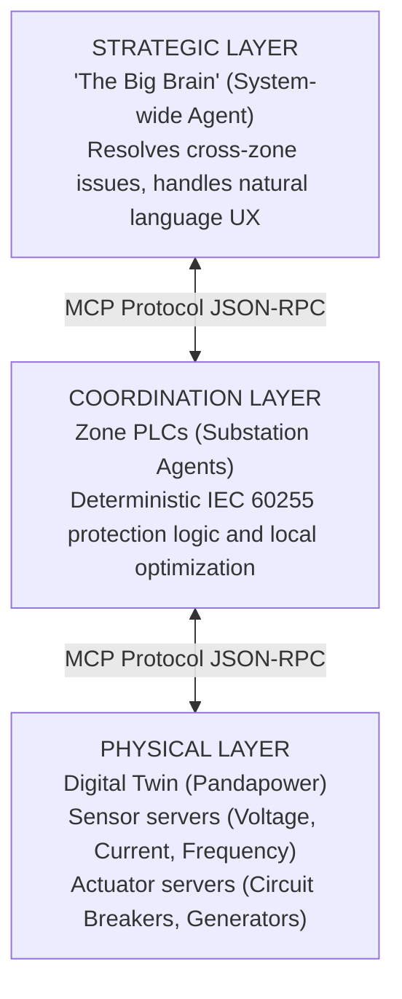

# OmniNode: Autonomous Infrastructure Agents

**Elevator Pitch**: A hierarchical, multi-agent simulation where specialized Large Language Models (LLMs) collaborate via the Model Context Protocol (MCP) to monitor, optimize, and safely control critical physical infrastructure (like power grids, robotics, or satellite networks) autonomously.

This project demonstrates how multiple specialized LLM agents can collaborate to manage critical infrastructure autonomously while ensuring operational safety.

## 🔥 Key Scenarios
The OmniNode architecture supports multiple interconnected domains:
- ⚡ **Power Grid**: Autonomous load balancing and fault protection (IEC 60255 compliant).
- 🤖 **Robotics**: Fleet coordination and path planning (Future Work).
- 🛰️ **Satellite**: Constellation health monitoring (Future Work).

## 🛡️ Safety & Constitutional AI
Unlike standard agents, OmniNode implements a **Guardian** layer. Before any physical command (like opening a circuit breaker or adjusting thrusters) is sent to hardware, it is validated against a strict *safety constitution* to prevent hallucinated destruction. This ensures deterministic hardware safety even when using probabilistic LLM reasoning.

---

## 🏗 System Architecture

The system operates across three distinct layers, integrated seamlessly via MCP:



### The Component Roster
The system runs the following roster of interconnected servers and agents:
- **1× Strategic Agent**: A master LLM (e.g., `llama3.1`) that reasons over the entire grid state, processes human commands, and acts as the ultimate decider for high-risk operations.
- **3× Zone Coordinators (PLCs)**: Deterministic, rule-based agents assigned to geographic zones (Buses 0–9, 10–19, 20–29). They handle local load balancing and voltage regulation autonomously using hard-coded safety rules (IEC 60255).
- **11× Sensor MCP Servers**: Continuous readers for Voltage, Current, Transformer Temperature, Power Quality (THD), and System Frequency.
- **5× Actuator MCP Servers**: Interfaces for Circuit Breakers, Generators, Load Controllers, Voltage Regulators (shunt capacitors), and Energy Storage.
- **1× Safety Guardian Agent**: *(Optional config)* Validates actuator commands before execution.
- **1× MCP Registry**: A lightweight discovery service (`FastAPI`) where all sensor, actuator, and coordinator tools are registered for discovery by the Strategic Agent.

---

## 🛠 Project Structure

```text
OmniNode/
├── backend/                       # Python backend (uv workspace)
│   ├── pyproject.toml             # Python dependencies & entry points
│   ├── src/
│   │   ├── common/                # Shared settings, LLM client, data models
│   │   ├── registry/              # FastAPI MCP registry + WebSocket server
│   │   ├── simulation/            # IEEE 30-bus Pandapower digital twin & scenarios
│   │   ├── physical/              # Physical Layer MCP Servers
│   │   │   ├── sensors/           # Voltage, current, temperature, frequency
│   │   │   └── actuators/         # Breakers, generators, capacitors, storage
│   │   ├── coordination/          # Zone Coordinator PLCs & optimization
│   │   ├── strategic/             # Strategic Agent, CLI, Guardian, Memory, Monitor
│   │   ├── api/                   # WebSocket routes & event bus
│   │   └── domains/               # Domain adapters (power grid, robotics, satellite)
│   ├── scripts/
│   │   ├── start_warroom.py       # Main entry point (mock or real mode)
│   │   └── start_all.py           # Legacy full-stack launcher
│   └── tests/                     # Unit and integration tests
├── frontend/                      # Next.js War Room dashboard
│   ├── package.json
│   └── src/
├── docker-compose.yml             # Infrastructure (EMQX, InfluxDB, Grafana)
├── .env / .env.example            # Environment configuration
├── docs/                          # MkDocs documentation
└── README.md
```

---

## 🚀 Quick Start

```bash
git clone https://github.com/charansoma3001/OmniNode && cd OmniNode
```

### 1. Install Backend Dependencies
```bash
cd backend && uv sync --all-extras
```

### 2. Install Frontend Dependencies
```bash
cd frontend && npm install
```

### 3. Start Infrastructure Services
Spin up the MQTT broker, InfluxDB, and Grafana:
```bash
docker-compose up -d
```

### 4. Configure Environment
Copy the `.env.example` to `.env` in the project root and update the values:
```bash
cp .env.example .env
```
Key configuration (see `.env.example` for all options):
```ini
# LLM Connection (Ollama)
LLM_API_KEY=ollama
LLM_BASE_URL=http://localhost:11434

# Multi-Agent Model Assignments
STRATEGIC_MODEL=llama3.1:latest
GUARDIAN_MODEL=llama-guard3:latest
```
*Note: Ensure the specified Ollama models are pulled (`ollama pull <model_name>`) before starting in real mode.*

---

## ▶️ Running the System

The system uses two terminals — one for the **backend** and one for the **frontend**.

### Terminal 1: Start the Backend

**Option A — Mock Demo Mode** *(no LLMs needed, uses simulated events)*
```bash
cd backend && uv run python scripts/start_warroom.py
```

**Option B — Real LLM Mode** *(connects to Ollama, runs live simulation + AI agents)*
```bash
cd backend && uv run python scripts/start_warroom.py --real
```

The backend starts the FastAPI server on `http://localhost:8000` with:
- MCP Registry & tool discovery
- WebSocket endpoints for real-time grid state, agent logs, guardian events, and commands
- Either mock event streaming (Option A) or live simulation with AI agents (Option B)

### Terminal 2: Start the Frontend
```bash
cd frontend && npm run dev
```
Access the War Room dashboard at **http://localhost:3000**.

---

## 🧪 Simulation Scenarios

The system includes predefined scenarios for testing and demonstrating the multi-agent response pipeline. Scenarios can be triggered via the CLI (`scenario <name>`) or programmatically.

| Scenario | Command | Description | Expected Agent Response |
|---|---|---|---|
| **Line Overload Recovery** | `scenario line_overload` | Injects a 50 MW load spike on Bus 7, causing line thermal violations | Topology reconfiguration or load shedding |
| **Voltage Collapse Prevention** | `scenario voltage_collapse` | Heavy loading across Buses 10–15 in Zone 2, driving voltages below limits | Capacitor bank activation and reactive power dispatch |
| **Cascading Failure Prevention** | `scenario cascading_failure` | Trips a critical transmission line (Line 0), risking cascading outages | Load shedding and generator redispatch |
| **Cyber Attack Detection** | `scenario cyber_attack` | Simulates false sensor data injection at the sensor layer | Sensor isolation and fallback to trusted readings |
| **Natural Language Optimization** | `scenario nl_optimization` | Creates an inefficient generator dispatch (high losses) | Generator redispatch for loss minimization |

Each scenario:
1. **Saves** a grid snapshot before injecting the fault
2. **Applies** the fault condition and runs a power flow
3. **Restores** the snapshot automatically (unless `persist=True` is used, in which case use `rollback` to restore)

---

## 💻 Interacting with the System

Once the `mcp-cli` is running (`cd backend && uv run mcp-cli`), you can issue both internal commands and natural language prompts:

### Built-in CLI Commands
- `status` — System-wide overview (Generation, Load, Losses, Frequency, Max Voltage/Loading)
- `zones` — Instantaneous health summaries for Zone 1, Zone 2, and Zone 3
- `history` — Last 5 decisions made by the Strategic Agent
- `monitor start / stop` — Toggle the background monitoring loop
- `rollback` — Revert the grid state to the original baseline snapshot
- `scenario <name>` — Inject a pre-defined scenario (see table above)
- `exit` / `quit` — Shut down the CLI

### Natural Language Control
Type instructions natively. The Strategic Agent translates these into MCP tool executions.

**Examples:**
- *"Why is Zone 3 showing a critical warning, and can you fix it?"*
- *"Open the circuit breaker on line 5 to simulate a fault and tell me what happens to the voltages."*
- *"Increase generation at bus 1 to 45 MW to handle the load."*
- *"Run a complete diagnostic of the system and resolve any existing voltage violations using the zone coordinators."*

---

## 🧠 How the AI Monitoring Loop Works

When running in **real mode** (`--real`), an asynchronous `MonitoringLoop` drives the system:

1. **Simulation Tick**: Loads fluctuate slightly via the `DataGenerator`, and `pandapower` runs a power flow analysis.
2. **Violation Detection**: The system checks voltages (0.95–1.05 p.u.), line loadings (< 100%), and frequency.
3. **Zone-First Delegation**: Violations are grouped by zone and dispatched to the respective **Zone Coordinator PLCs** in parallel.
4. **Autonomous Correction**: Zone PLCs evaluate against deterministic safety rules (IEC 60255) and execute local tools (switching shunt capacitors, shifting load) to fix the grid.
5. **Strategic Escalation**: If multiple zones are failing, or a zone requests help, violations are aggregated and fed into the **Strategic Agent**.
6. **Master Execution**: The Strategic Agent reads the context and executes cross-zone or high-risk tools to stabilize the grid.

---

## 🔧 Extensibility

Because the system is built strictly using the **Model Context Protocol**, adding new capabilities is straightforward:

1. **New Sensors/Actuators**: Create a new class extending `mcp.server.Server`. Add `@self.mcp.list_tools()` and `@self.mcp.call_tool()` decorators. Register it in the `PowerGridAdapter`.
2. **New Domains**: Replace `src/simulation/power_grid.py` with an adapter for a robotics system or satellite network. As long as they expose MCP servers, the Strategic Agent can discover and operate them.
3. **New Scenarios**: Add a setup function and validator to `backend/src/simulation/scenarios.py` and register it in the `SCENARIOS` dictionary.
