# Core Concepts

OmniNode is a hierarchical, multi-agent control system where specialized LLMs collaborate via the **Model Context Protocol (MCP)** to monitor, optimize, and safely control critical physical infrastructure. This page explains the fundamental concepts that underpin the system.

---

## The Domains

The architecture is domain-agnostic. It wraps physical simulation data into standard MCP servers, meaning the same Strategic Agent can operate across fundamentally different industries.

| Domain | Simulation Engine | Status |
|---|---|---|
| **Power Grid** (IEEE 30-bus) | `pandapower` | ✅ Active |
| **Robotics** | Kinematic chains, LiDAR | 🔜 Planned |
| **Satellite** | Orbital mechanics, comms | 🔜 Planned |

The power grid domain is the primary implementation. It models generation, transmission, and load across a 30-bus network, providing real-time sensor data (voltage, current, frequency) and actuator controls (circuit breakers, generators, capacitor banks, load controllers).

---

## The Three-Tier Agent Hierarchy

The system operates across three distinct tiers, each with a dedicated responsibility scope.

```mermaid
graph TD
    subgraph TIER_1["TIER 1 — Strategic Layer"]
        Agent["Strategic Agent<br/>(LLM: qwen2.5:14b)"]
    end
    subgraph TIER_2["TIER 2 — Coordination Layer"]
        Z1["Zone 1 PLC<br/>(Buses 0–9)"]
        Z2["Zone 2 PLC<br/>(Buses 10–19)"]
        Z3["Zone 3 PLC<br/>(Buses 20–29)"]
    end
    subgraph TIER_3["TIER 3 — Physical Layer"]
        Sensors["11× Sensor MCP Servers"]
        Actuators["5× Actuator MCP Servers"]
        Grid["Pandapower Digital Twin"]
    end

    Agent <-->|"MCP Tool Calls"| Z1
    Agent <-->|"MCP Tool Calls"| Z2
    Agent <-->|"MCP Tool Calls"| Z3
    Z1 <--> Sensors
    Z2 <--> Sensors
    Z3 <--> Sensors
    Z1 <--> Actuators
    Z2 <--> Actuators
    Z3 <--> Actuators
    Sensors <--> Grid
    Actuators <--> Grid
```



### Tier 1: The Strategic Agent
A powerful LLM (e.g., `qwen2.5:14b`) focused on global, cross-zone reasoning. It serves as the system's "Big Brain," aggregating information from all zones and handling complex trade-offs or cascading failures that a single zone cannot resolve. It also serves as the user-facing natural language interface via the War Room Command Bar.

**Key behaviours:**

- **Forced Tool Use ("Agentic Override"):** The agent is configured with `tool_choice="required"` and a strict system prompt that explicitly forbids conversational summaries. This physically prevents the LLM from returning a paragraph of text instead of executing a corrective action—a problem we call "Chatbot Syndrome."
- **Dynamic Context Injection:** On every query, the agent's prompt is populated with the current grid state, available device IDs, and recent decisions to minimise hallucination.

### Tier 2: Zone Coordinator PLCs
Three deterministic, rule-based controllers assigned to geographic subsets (zones) of the grid. They are **not** LLM-powered. They use hard-coded safety logic derived from industrial standards.

| Zone | Buses | Standards |
|---|---|---|
| Zone 1 | 0 – 9 | IEC 60255-127, BS EN 60255-1 |
| Zone 2 | 10 – 19 | IEC 60255-127, BS EN 60255-1 |
| Zone 3 | 20 – 29 | IEC 60255-127, BS EN 60255-1 |

**Key behaviours:**

- Monitor local sensors continuously every cycle.
- Apply deterministic voltage regulation (shunt capacitor switching) and overcurrent protection rules.
- Invoke local actuators to rectify issues without LLM latency.
- If an issue exceeds local thresholds or persists across multiple cycles, automatically escalate to the Strategic Agent.

### Tier 3: The Physical Layer
The bottom layer consists of the simulation engine and its MCP server wrappers.

- **Sensors (11 servers):** Provide read-only data. Types include Voltage, Current, Power Quality (THD), Transformer Temperature, and System Frequency sensors, deployed per-zone and system-wide.
- **Actuators (5 servers):** Provide write access to the simulation. Types include Circuit Breakers, Generators, Load Controllers, Voltage Regulators (shunt capacitors), and Energy Storage systems.
- **MCP Registry:** A lightweight FastAPI discovery service where all servers register their tool schemas on startup. The Strategic Agent queries the registry to dynamically discover all available tools.

---

## The Safety Guardian

Unlike standard agents, OmniNode implements a dedicated **Safety Guardian** layer. The Guardian is a separate LLM instance (e.g., `llama-guard3`) that acts as an immutable safety boundary.

**How it works:**

1. The Strategic Agent decides to execute an actuator tool call (e.g., `control` on a `load_controller`).
2. Before the tool call reaches the actuator, the `StrategicAgent._call_server_tool()` method intercepts it and `await`s the `SafetyGuardian.validate_command()` coroutine.
3. The Guardian LLM evaluates the command against safety criteria (e.g., "load shedding > 50% is HIGH risk").
4. If **safe**, the action proceeds and a green `APPROVED` event is published to the War Room UI.
5. If **unsafe**, the action is **blocked**, a red `BLOCKED` event is published, and the Strategic Agent receives an error response, forcing it to re-plan.


---

## The Event Bus

The `EventBus` (`src/api/event_bus.py`) is a singleton, asynchronous, in-memory Pub/Sub system that decouples backend components from the frontend WebSocket layer.

**Key design decisions:**

| Feature | Detail |
|---|---|
| **Pattern** | Singleton (one bus per process) |
| **Topics** | `grid_state`, `agent_log`, `guardian_event` |
| **Auto-timestamps** | If a published `dict` message is missing a `timestamp` key, the bus automatically injects one (ISO 8601), preventing `[Invalid Date]` errors in the UI. |
| **Bounded Queues** | Each subscriber gets a `maxsize=100` queue. If full, old messages are dropped to prevent memory leaks. |

Any component (the simulation monitoring loop, the Strategic Agent, or the Safety Guardian) can publish events instantly, and the WebSocket bridge subscribers forward them to the frontend in real time.

---

## The Monitoring Loop

The `MonitoringLoop` (`src/strategic/monitor.py`) is the heartbeat of the system. It runs as a background `asyncio` task on a configurable interval (default: 5 seconds).

**Each cycle:**

1. **Simulation Tick:** Loads fluctuate slightly via the `DataGenerator`, and `pandapower` runs a power flow analysis.
2. **Violation Detection:** Voltages are checked against the 0.95–1.05 p.u. range, line loadings against 100%, and frequency against 49.5–50.5 Hz.
3. **Zone-First Delegation:** Violations are grouped by zone and dispatched to the respective Zone Coordinator PLCs in parallel.
4. **Autonomous Correction:** Zone PLCs evaluate violations against their IEC 60255 rule sets and execute local actuator tools (e.g., switching shunt capacitors, adjusting tap changers) deterministically.
5. **Strategic Escalation:** If violations persist or exceed local capabilities, they are aggregated and fed to the Strategic Agent LLM for cross-zone reasoning.
6. **State Publication:** The `grid.get_state()` payload (including nodes, edges, zone health, and violations) is published to the `grid_state` EventBus topic, immediately updating the War Room topology map.

---

## Data Flow Summary

```
Simulation Tick → Sensor Servers Read State → Monitoring Loop Detects Violations
→ Zone PLC Evaluates Rules → PLC Calls Actuator Tool
→ If Unresolved: Escalate to Strategic Agent → Agent Calls Tools via Guardian
→ All Events Published to EventBus → WebSocket Bridge → War Room UI
```
