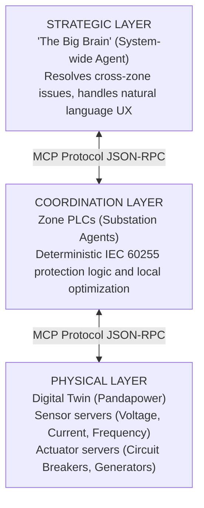

# OmniNode: Autonomous Infrastructure Agents

**Elevator Pitch**: A hierarchical, multi-agent simulation where specialized Large Language Models (LLMs) collaborate via the Model Context Protocol (MCP) to monitor, optimize, and safely control critical physical infrastructure (like power grids, robotics, or satellite networks) autonomously.

This project demonstrates how multiple specialized LLM agents can collaborate to manage critical infrastructure autonomously while ensuring operational safety.

## 🔥 Key Scenarios
The OmniNode architecture supports multiple interconnected domains:
- ⚡ **Power Grid**: Autonomous load balancing and fault protection (IEC 60255 compliant).
- 🤖 **Robotics**: Fleet coordination and path planning.
- 🛰️ **Satellite**: Constellation health monitoring.

## 🛡️ Safety & Constitutional AI
Unlike standard agents, OmniNode implements a **Guardian** layer. Before any physical command (like opening a circuit breaker or adjusting thrusters) is sent to hardware, it is validated against a strict *safety constitution* to prevent hallucinated destruction. This ensures deterministic hardware safety even when using probabilistic LLM reasoning.

---

## 🏗 System Architecture

The system operates across three distinct layers, integrated seamlessly via MCP:



### The Component Roster
The system runs the following roster of interconnected servers and agents:
- **1× Strategic Agent**: A master LLM (e.g., `qwen2.5:14b`) that reasons over the entire grid state, processes human commands, and acts as the ultimate decider for high-risk operations.
- **3× Zone Coordinators (PLCs)**: Deterministic, rule-based agents assigned to geographic zones (Buses 0–9, 10–19, 20–29). They handle local load balancing and voltage regulation autonomously using hard-coded safety rules (IEC 60255).
- **11× Sensor MCP Servers**: Continuous readers for Voltage, Current, Transformer Temperature, Power Quality (THD), and System Frequency.
- **5× Actuator MCP Servers**: Interfaces for Circuit Breakers, Generators, Load Controllers, Voltage Regulators (shunt capacitors), and Energy Storage.
- **1× Safety Guardian Agent**: A dedicated safety LLM (`llama-guard3`) that validates every actuator command before execution. If a command is deemed unsafe, it is blocked and the Strategic Agent must re-plan.
- **1× MCP Registry**: A lightweight FastAPI discovery service where all sensor, actuator, and coordinator tools are registered for discovery by the Strategic Agent.

---

## 🛠 Project Structure

```text
mcp-multi-agent/
├── pyproject.toml             # Python dependencies (uv)
├── mkdocs.yml                 # Zensical documentation configuration
├── .env                       # Environment configuration (LLMs, API keys)
├── scripts/
│   ├── start_all.py           # Legacy CLI-only orchestrator
│   └── start_warroom.py       # War Room launcher (backend + WebSocket bridge)
├── src/
│   ├── api/                   # WebSocket bridge, Event Bus, mock streams
│   ├── common/                # Shared settings, LLM client wrapper, data models
│   ├── registry/              # FastAPI MCP registry server (`mcp-registry`)
│   ├── simulation/            # IEEE 30-bus Pandapower digital twin & data generation
│   ├── physical/              # Physical Layer MCP Servers
│   │   ├── sensors/           # Voltage, current, temperature, frequency MCP servers
│   │   └── actuators/         # Breaker, generator, capacitor MCP servers
│   ├── coordination/          # Zone Coordinator MCP servers & optimization heuristics
│   ├── strategic/             # Strategic Agent, Safety Guardian, CLI, Memory, Monitor
│   └── domains/               # Domain adapters wrapping the simulation for MCP
├── dashboard/                 # War Room Frontend (Next.js / React Flow / shadcn/ui)
│   └── src/
│       ├── components/war-room/ # TopologyMap, BrainScanner, GuardianPanel, CommandBar
│       └── hooks/             # useGridState, useAgentLogs, useGuardianEvents
└── tests/                     # Unit and integration tests
```

---

## 🚀 Quick Start

Launch the entire ecosystem with a one-liner:
```bash
git clone https://github.com/charansoma3001/OmniNode && cd OmniNode && uv sync && docker-compose up -d
```

### Installation Details

1. **Clone and Install Dependencies:**
   ```bash
   uv sync --all-extras
   ```

2. **Start Infrastructure Services:**
   Spin up the required MQTT broker and InfluxDB instances:
   ```bash
   docker-compose up -d
   ```

3. **Configure Environment:**
   Copy the `.env` template or create a new `.env` file in the root directory:
   ```ini
   # /mcp-multi-agent/.env

   # Strategic agent: cross-zone reasoning
   STRATEGIC_MODEL=llama3.1:latest

   # LLM Connection
   LLM_API_KEY=ollama
   LLM_BASE_URL=http://localhost:11434
   LLM_CONTEXT_WINDOW=8192  # Increased for complex grid state reasoning
   ```
   *Note: Ensure the specified Ollama models are pulled (`ollama pull <model_name>`) before starting.*

---

## ▶️ Running the System

To run the full suite, you need to open multiple terminal instances. The project leverages `uv run` to ensure scripts execute within the correct virtual environment path.

**Terminal 1: Launch the War Room Backend + Frontend**
The `start_warroom.py` script boots the FastAPI registry, all MCP servers, the monitoring loop, and the WebSocket bridge in one command.
```bash
# Real LLM mode (requires Ollama)
python scripts/start_warroom.py --real

# Demo mode (no LLM required, pre-scripted events)
python scripts/start_warroom.py
```

**Terminal 2: Launch the War Room Frontend Dashboard**
The interactive Next.js dashboard at `http://localhost:3000`.
```bash
cd dashboard && npm run dev
```

**Terminal 3 (Optional): Launch the CLI Interface**
The legacy natural language CLI for direct agent interaction.
```bash
uv run mcp-cli
```

---

## 💻 Interacting with the System

Once the `mcp-cli` is running, you can issue both internal commands and natural language prompts:

### Built-in CLI Commands
- `status`: Prints a system-wide overview (Generation, Load, Losses, Frequency, Max Voltage/Loading).
- `zones`: Displays instantaneous health summaries for Zone 1, Zone 2, and Zone 3.
- `history`: Shows the last 5 decisions made by the Strategic Agent.
- `monitor start / stop`: Toggles the background monitoring loop.
- `rollback`: Reverts the grid state to the original baseline snapshot.
- `scenario <name>`: Injects a pre-defined fault or demand spike (e.g., `scenario peak_load`).
- `exit` or `quit`: Shut down the CLI.

### Natural Language Control
You can type instructions natively. The Strategic Agent translates these into MCP tool executions.

**Examples:**
- *"Why is Zone 3 showing a critical warning, and can you fix it?"*
- *"Open the circuit breaker on line 5 to simulate a fault and tell me what happens to the voltages."*
- *"Increase generation at bus 1 to 45 MW to handle the load."*
- *"Run a complete diagnostic of the system and resolve any existing voltage violations using the zone coordinators."*

---

## 🧠 How the AI Monitoring Loop Works

When you run `start_all.py`, an asynchronous `MonitoringLoop` begins.
Here is what happens every interval (e.g., 30 seconds):

1. **Simulation Tick**: Loads fluctuate slightly via the `DataGenerator`, and `pandapower` runs a power flow analysis.
2. **Violation Detection**: The system checks voltages (0.95–1.05 p.u.), line loadings (< 100%), and frequency.
3. **Zone-First Delegation**: If violations exist, they are grouped by zone and dispatched to the respective **Zone Coordinator PLCs** in parallel.
4. **Autonomous Correction**: Zone PLCs evaluate their domains against deterministic safety rules (e.g., IEC 60255) and execute local tools (e.g., switching shunt capacitors or shifting load) to fix the grid.
5. **Strategic Escalation**: If multiple zones are failing, or a zone specifically requests help ("Escalate to strategic agent"), the violations are aggregated and fed into the **Strategic Agent**.
6. **Master Execution**: The Strategic Agent reads the context and executes cross-zone or high-risk tools to stabilize the grid.

---

## 🔧 Extensibility

Because the system is built strictly using the **Model Context Protocol**, adding new capabilities is incredibly straightforward:

1. **New Sensors/Actuators**: Create a new class extending `BaseSensor` or `BaseActuator`. Implement the required handlers and register in the server startup flow.
2. **New Domains**: Replace `src/simulation/power_grid.py` with an adapter for a robotics system or a satellite network. As long as they expose MCP servers, the Strategic Agent LLM can discover and operate them.
3. **New Actuator Actions**: Add entries to `_ACTION_ALIASES` in the actuator class to normalise LLM-generated action names.

---

## 🖥️ War Room Dashboard

The **War Room** is a real-time, interactive command center that provides absolute observability into the autonomous operations of the multi-agent system. It bridges the physical layer and the cognitive layer into a single visual interface.

See the [War Room UI](war-room.md) documentation for full architectural details.

**Key widgets:**

| Widget | Description |
|---|---|
| **Topology Map** | React Flow IEEE 30-bus network with live color-coded node health |
| **Brain Scanner** | Hacker-styled terminal streaming the Strategic Agent's inner monologue |
| **Guardian Panel** | Real-time log of Safety Guardian approve/block decisions |
| **KPI Cards** | Generation, load, frequency, and violation counts |
| **Command Bar** | Natural language queries and scenario injection |
