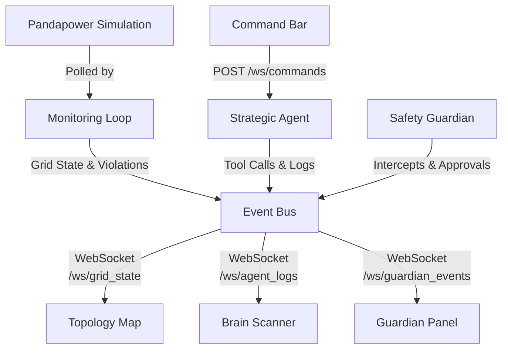

# OmniNode War Room

The **OmniNode War Room** is a real-time, interactive frontend dashboard designed to provide absolute observability into the autonomous operations of the multi-agent system.

It bridges the gap between the physical layer (the simulated power grid) and the cognitive layer (the LLM Strategic Agent and automated Zone Coordinators), transforming a "black box" AI system into a transparent, interactive command center.

## 🎯 The Problem and Our Goal

### The Problem: Chatbot Syndrome
Initially, debugging an AI system that controls physical infrastructure via a terminal or simple chat UI is dangerously opaque. When a grid disturbance occurs, the AI might reason properly but fail to output strict tool calls (often summarizing its intent in paragraphs of text instead of taking action—a phenomenon we call **Chatbot Syndrome**). Furthermore, without a visual map, an operator cannot quickly comprehend the cascading effects of a voltage drop across a 30-bus network.

### The Goal: Absolute Observability & Safety
The primary objective of the War Room is to ensure **Safety and Transparency**. We achieve this by:
1. **Visualizing the Physical Layer:** Real-time topology maps showing line loading, node voltages, and zone health via visual color coding.
2. **Exposing the Cognitive Layer:** Streaming the inner monologue and raw tool calls of the Strategic Agent directly to the screen as it happens.
3. **Enforcing "Agentic Override":** Forcing the LLM to output valid JSON Tool Calls to the Model Context Protocol (MCP) server, rather than conversational text.
4. **Validating Actions (The Guardian):** Introducing an explicit AI safety boundary that catches and evaluates any physical actuator command *before* it hits the hardware.

---

## 🏗️ Architecture

The War Room operates on an event-driven websocket architecture connecting the **FastAPI Backend** to a **Next.js Frontend**.

### 1. The Backend Event Bus
We implemented a lightweight, asynchronous generic `EventBus` (`src/api/event_bus.py`). It acts as an in-memory Pub/Sub system. Any component of the backend (the simulation, the agent, or the guardian) can instantly `publish()` a payload to a topic.

### 2. FastAPI WebSocket Bridge
The `src/api/websocket.py` module exposes asynchronous WebSocket endpoints (`/ws/grid_state`, `/ws/agent_logs`, `/ws/guardian_events`). It `subscribe()`s to the corresponding topics on the EventBus and streams JSON directly to the frontend the millisecond an event fires, eliminating polling latency.

### 3. Next.js + React Flow + shadcn/ui
The frontend (`dashboard/`) is a Next.js application built with Tailwind CSS, shadcn/ui components, and Framer Motion for premium, modern animations.

---

## 🧩 Core UI Components

### 1. The Topology Map
Located at the center of the UI, the `TopologyMap` uses `React Flow` to render the IEEE 30-bus grid.
- **Node Coloring:** Buses are colored dynamically (Blue = Healthy, Yellow = Warning, Red = Critical) based on voltage per-unit values.
- **Animated Edges:** Lines use dashed SVG animations to represent power flow.
- **Zone Boundaries:** The 30 buses are grouped into three distinct geographical zones (Zone 1, Zone 2, Zone 3), highlighting localized health logic.

### 2. The AI Brain Scanner
A hacker-styled terminal on the right panel that provides an x-ray into the Strategic Agent.
- When the agent receives an escalation from a Zone Coordinator, it queries the LLM.
- The Brain Scanner intercepts these steps, using a real-time typewriter effect to display `🧠 ANALYZING` and `🔧 CALLING MCP TOOL` logs.
- This allows the human operator to see *why* the AI chose to shed load before it happens.

### 3. The Guardian Intercept Panel
The ultimate safety net, sitting prominently below the Brain Scanner.
- **The Concept:** A standalone LLM (e.g., `llama-guard3`) is instantiated as the `SafetyGuardian` (`src/strategic/guardian.py`).
- **The Intercept Pipeline:** When the Strategic Agent decides to execute an actuator tool (e.g., `control` on the `load_controller`), the tool execution loop implicitly pauses and routes the intended payload through the `SafetyGuardian`.
- **The Visuals:** If the action is safe, the panel flashes a green `APPROVED` badge. If the action would precipitate a major blackout, it flashes a red `BLOCKED` badge with the specific constitutional rule violation. The backend then rejects the tool call, forcing the Strategic Agent to rethink its approach.

### 4. The Command Bar
A bottom-anchored input interface allowing the human operator to interact.
- Can be used to ask natural language questions ("Why is Zone 3 critical?").
- Can be used to inject catastrophic scenarios ("trigger_scenario cyber_attack") specifically to test the autonomous recovery logic of the system.

---

## 🛠️ Overcoming Engineering Challenges

### Fixing "Chatbot Syndrome"
During testing, the Qwen2.5 / LLaMA models frequently responded to grid crises with long-winded paragraphs summarizing the grid state instead of executing the `voltage_regulator` tool. 
- **The Fix:** We implemented an **Agentic Override** in `llm_client.py`. By deeply modifying the system prompt to explicitly reject conversational pleasantries, and enforcing rigid JSON schema constraints on the API request, we physically forced the model to return valid function calls.

### Asynchronous Execution Contexts
When wiring the `SafetyGuardian` to the `StrategicAgent`'s execution loop, injecting `asyncio.run(guardian.validate_command())` crashed the web server because FastAPI was already running an event loop.
- **The Fix:** Pushed the async execution boundary further down the stack. We refactored `_call_server_tool` to be an `async def` function, allowing the agent to seamlessly `await` the external LLM validation without blocking the WebSocket data streams.

### Handling Non-JSON LLM Output
Models like `llama-guard3` act as pure classifiers and frequently ignore `{"safe": true}` JSON constraints, opting instead to output literal strings like `safe` or `unsafe\n[reason]`.
- **The Fix:** We implemented a greedy fallback parser in `guardian.py`. If `json.loads()` fails, the code manually strips whitespace and parses the raw text starting states to map it back into the strict React JSON schema required by the UI.
